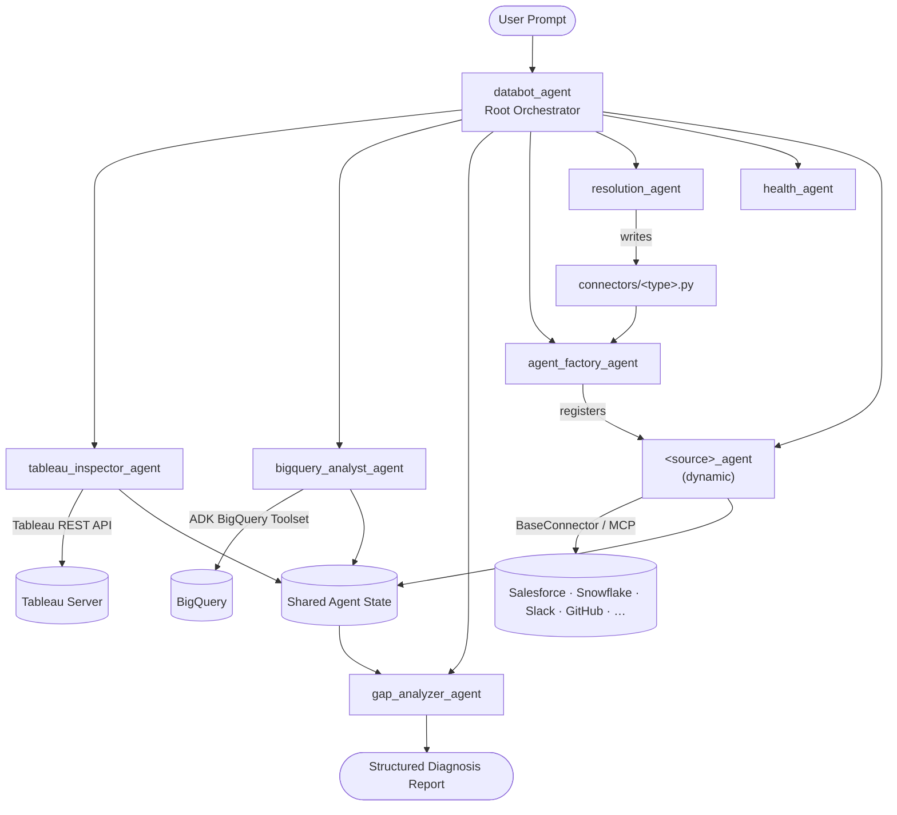

# Databot Agent

**An AI-powered, multi-source data diagnostic agent built on Google ADK.**

Databot investigates data discrepancies across BI dashboards and source systems. When a Tableau metric looks wrong, a Salesforce record is missing from a warehouse table, or two systems disagree, Databot routes the question to the right specialist agents, gathers evidence from each data source, and produces a structured root-cause diagnosis.

> **Example question:** *"Why is this Salesforce customer not showing in our `company_core` BigQuery table?"*

---

## Table of Contents

- [Problem Statement](#problem-statement)
- [Solution Overview](#solution-overview)
- [Framework & Tech Stack](#framework--tech-stack)
- [Architecture](#architecture)
- [Specialist Agents](#specialist-agents)
- [Supported Data Sources](#supported-data-sources)
- [Extensibility Model](#extensibility-model)
- [Project Structure](#project-structure)
- [Prerequisites](#prerequisites)
- [Installation](#installation)
- [Configuration](#configuration)
- [Running the Agent](#running-the-agent)
- [Example Prompts](#example-prompts)
- [Design Decisions](#design-decisions)
- [Security](#security)
- [License](#license)

---

## Problem Statement

Data teams routinely face questions like:

- *"The dashboard shows $45M revenue — is that correct?"*
- *"Why doesn't this customer appear in BigQuery but exists in Salesforce?"*
- *"Is the Tableau extract stale, or is the underlying SQL wrong?"*

Answering these requires cross-system investigation: checking the BI layer (Tableau), querying the warehouse (BigQuery), comparing against CRM (Salesforce), and synthesizing findings into an actionable diagnosis. Databot automates that workflow using a **multi-agent orchestration pattern** on top of **Google's Agent Development Kit (ADK)**.

---

## Solution Overview

Databot is a **dynamic orchestrator** — not a fixed pipeline. A root agent (`databot_agent`) reads each user prompt and delegates only to the specialist agents needed for that question.

| Capability | How Databot handles it |
|---|---|
| Dashboard verification | Tableau REST API — inspect workbooks, fetch view data, discover datasource connections |
| Ground-truth queries | BigQuery (read-only SQL via ADK toolset) |
| Cross-source comparison | Dynamically registered agents (Salesforce, Snowflake, Slack, etc.) |
| Root-cause synthesis | Reasoning agent that compares findings and recommends fixes |
| New source onboarding | Agent Factory (MCP or connector) + Resolution Agent (auto-generated connectors) |
| Connection health | Health Agent monitors all registered sources |

---

## Framework & Tech Stack

| Layer | Technology |
|---|---|
| **Agent framework** | [Google ADK](https://google.github.io/adk-docs/) (`google-adk`) — multi-agent orchestration, tool calling, shared session state |
| **Project scaffold** | Google Agent Starter Pack (`tool.agent-starter-pack` in `pyproject.toml`) |
| **LLM (primary)** | Claude via Anthropic API (`claude-sonnet-4-6`) or Gemini via Vertex AI (`gemini-2.0-flash`) |
| **Cloud platform** | Google Cloud Platform — BigQuery, Vertex AI, Cloud Logging |
| **BI integration** | Tableau REST API |
| **MCP integration** | Model Context Protocol servers for Slack, GitHub, Notion, Linear, PostgreSQL |
| **Language** | Python 3.10–3.12 |
| **Package manager** | [uv](https://docs.astral.sh/uv/) (`uv_build` backend) |
| **Config** | `python-dotenv` (`.env` file) |
| **Data validation** | Pydantic v2 |

### Why Google ADK?

ADK provides the primitives this project needs out of the box:

- **`Agent`** objects with instructions, tools, and `output_key` for shared state
- **Sub-agent delegation** — the root agent routes to specialists dynamically
- **First-party BigQuery toolset** with `WriteMode.BLOCKED` for read-only enforcement
- **`MCPToolset`** for plugging in external MCP servers as agent tools
- **`ToolContext.state`** — agents pass findings (Tableau inspection → BigQuery analysis → diagnosis) through a shared session

---

## Architecture



### Orchestration Model

Unlike a rigid sequential pipeline, Databot uses **LLM-driven dynamic routing**:

```
User question → root_agent selects minimum agents → agents write to shared state → gap_analyzer synthesizes
```

The root agent follows a decision matrix (defined in `databot_agent/agent.py`):

| Prompt type | Agents invoked (in order) |
|---|---|
| "Why does dashboard X show the wrong value?" | Tableau → BigQuery → Gap Analyzer |
| "What is the BigQuery value for metric Y?" | BigQuery → Gap Analyzer |
| "Is dashboard X loading?" | Tableau only |
| "What does Salesforce say about customer Z?" | `salesforce_agent` → Gap Analyzer |
| "Why is the dashboard different from Salesforce?" | Tableau → `salesforce_agent` → Gap Analyzer |
| "Search Slack for mentions of X" | `slack_agent` only |
| Source not yet registered (known type) | Agent Factory |
| Source not yet registered (unknown type) | Agent Factory → Resolution Agent → Agent Factory |
| "Are all connections healthy?" | Health Agent |

**Key principle:** invoke the minimum set of agents. A pure BigQuery question never triggers a Tableau API call.

---

## Specialist Agents

| Agent | Role | Tools / Integration | State output key |
|---|---|---|---|
| `tableau_inspector_agent` | Verify dashboard issues, fetch view data, discover BigQuery datasource connections | `inspect_dashboard`, `get_view_data_sample` | `tableau_inspection_summary` |
| `bigquery_analyst_agent` | Run read-only diagnostic SQL against underlying warehouse tables | ADK `BigQueryToolset`, `prepare_diagnostic_queries`, `save_query_results` | `bigquery_analysis_summary` |
| `gap_analyzer_agent` | Synthesize findings into a structured root-cause report with recommended fixes | Reasoning only (reads shared state) | `diagnosis_report` |
| `agent_factory_agent` | Register new data-source agents at runtime (MCP, connector, or unknown) | `list_registered_agents`, `test_and_register_agent`, `refresh_oauth_token`, … | `agent_factory_summary` |
| `resolution_agent` | Autonomously generate `BaseConnector` implementations for unknown APIs | `get_connector_interface`, `write_connector_file`, `test_connector` | `resolution_summary` |
| `health_agent` | Monitor connection health across all registered sources | `check_all_connections`, `get_health_report` | `health_report` |
| `<source>_agent` | Query a dynamically registered source (e.g. `salesforce_agent`) | Per-source query tool or MCP toolset | `<source>_query_results` |

### Gap Analyzer Output

The gap analyzer produces a structured report including:

1. **Issue summary** — what was reported vs. what was confirmed
2. **Tableau vs. BigQuery comparison table** — reported value, actual value, delta
3. **Root cause** — filter mismatch, stale extract, schema change, calculation logic, timezone handling, duplicate rows
4. **Recommended fix** — immediate, validation, and long-term actions
5. **Verification SQL** — a query to confirm the fix

---

## Supported Data Sources

### Built-in (always available)

| Source | Integration | Auth |
|---|---|---|
| **Tableau** | Tableau REST API (personal access token) | `TABLEAU_SERVER_URL`, `TABLEAU_TOKEN_NAME`, `TABLEAU_TOKEN_SECRET` |
| **BigQuery** | Google ADK BigQuery toolset (Application Default Credentials) | `GOOGLE_CLOUD_PROJECT` |

Both support a **dummy/simulation mode** when credentials are not configured (`USE_TABLEAU_API=false`, `USE_BIGQUERY=false`), useful for development and demos.

### Built-in Connectors (`connectors/`)

| Connector | Query language | Optional package |
|---|---|---|
| **Salesforce** | SOQL | `simple_salesforce` |
| **Snowflake** | SQL | `snowflake-connector-python` |
| **REST API** | HTTP GET/POST (JSON) | `requests` (included) |

### MCP-backed Sources (via Agent Factory)

| Source | MCP Server | Required env var |
|---|---|---|
| **Slack** | `@modelcontextprotocol/server-slack` | `SLACK_BOT_TOKEN` |
| **GitHub** | `@modelcontextprotocol/server-github` | `GITHUB_PERSONAL_ACCESS_TOKEN` |
| **Notion** | `@notionhq/notion-mcp-server` | `NOTION_API_KEY` |
| **Linear** | `@linear/mcp-server` | `LINEAR_API_KEY` |
| **PostgreSQL** | `@modelcontextprotocol/server-postgres` | `POSTGRES_CONNECTION_STRING` |

### Custom Sources

For APIs with no existing connector or MCP server, the **Resolution Agent** autonomously:

1. Reads the `BaseConnector` interface and a reference implementation (Salesforce)
2. Writes `connectors/<source_type>.py`
3. Validates syntax, imports, and interface compliance
4. Tests the connection
5. Hands off to the Agent Factory for registration

---

## Extensibility Model

Databot supports three paths for adding a new data source, checked in priority order:

```
1. MCP registry     →  MCPToolset agent (no code generation)
2. Connector registry →  BaseConnector class (Salesforce, Snowflake, REST API)
3. Resolution Agent  →  LLM-generated connector (unknown APIs)
```

### BaseConnector Interface

Every connector extends `BaseConnector` (`connectors/base.py`):

```python
class BaseConnector(ABC):
    SOURCE_TYPE: str
    DISPLAY_NAME: str
    DESCRIPTION: str
    CAPABILITIES: list[str]
    AUTH_METHODS: list[str]          # e.g. ["oauth2", "basic"]

    @classmethod
    def test_connection(cls, credentials: dict) -> dict: ...

    @classmethod
    def query(cls, query: str, **kwargs) -> dict: ...
```

Connectors are **auto-discovered** from `connectors/*.py` at import time (`CONNECTOR_REGISTRY`).

### Runtime Agent Registration

When a new source is registered via the Agent Factory:

1. Credentials are validated and saved to `.env` (secrets never go into the registry JSON)
2. A live ADK `Agent` is appended to `root_agent.sub_agents` at runtime (`agent_store.py`)
3. A static agent file is written to `source_agents/<source>_agent.py` for persistence across restarts
4. Metadata is stored in `agent_registry/agents_registry.json` (env-var key names only, no secret values)

### OAuth 2.0 Support

The `auth_manager` module handles OAuth 2.0 client credentials, authorization code flows, token exchange, and token refresh — used by Salesforce, Snowflake, REST API, and dynamically generated connectors.

---

## Project Structure

```
databot-agent/
├── databot_agent/
│   ├── agent.py                  # Root orchestrator + all specialist agent definitions
│   ├── __init__.py               # Env bootstrap (GCP auth, Vertex AI routing)
│   │
│   ├── tableau_tools/
│   │   └── tableau_api.py        # Tableau REST API client + ADK tools
│   │
│   ├── bigquery_utils/
│   │   └── bigquery_tools.py     # ADK BigQuery toolset + diagnostic query helpers
│   │
│   ├── connectors/
│   │   ├── base.py               # BaseConnector abstract interface
│   │   ├── salesforce.py         # Salesforce SOQL connector
│   │   ├── snowflake.py          # Snowflake SQL connector
│   │   └── rest_api.py           # Generic REST API connector
│   │
│   ├── agent_factory/
│   │   ├── factory_tools.py      # ADK tools for agent registration
│   │   ├── agent_builder.py      # Builds ADK agents + MCP registry
│   │   ├── agent_store.py        # Runtime sub-agent list management
│   │   └── auth_manager.py       # OAuth 2.0 flows and credential handling
│   │
│   ├── agent_registry/
│   │   ├── registry.py           # Persistent JSON registry (metadata only)
│   │   └── agents_registry.json  # Registered agent metadata
│   │
│   ├── resolution_agent/
│   │   └── resolution_tools.py # Autonomous connector code generation
│   │
│   ├── health_agent/
│   │   └── health_tools.py       # Connection health monitoring
│   │
│   └── source_agents/            # Auto-generated agent files (created at runtime)
│
├── .env.example                  # Environment variable template
├── .gitignore
└── pyproject.toml                # Dependencies, ADK config, pytest settings
```

---

## Prerequisites

- **Python** 3.10, 3.11, or 3.12
- **[uv](https://docs.astral.sh/uv/)** (recommended) or pip
- **Google Cloud SDK** (`gcloud`) with Application Default Credentials configured
- **Node.js** (for MCP-backed sources — runs MCP servers via `npx`)
- **Tableau** personal access token (optional — dummy mode available)
- **Anthropic API key** or **Vertex AI** access for the LLM

---

## Installation

```bash
# Clone the repository
git clone https://github.com/Varthni-98/Databot-agent.git
cd Databot-agent

# Create and activate a virtual environment
python -m venv .venv
source .venv/bin/activate        # macOS / Linux
# .venv\Scripts\activate         # Windows

# Install dependencies (with uv)
uv sync

# Or with pip
pip install -e .
```

### Optional connector packages

Install only the connectors you need:

```bash
pip install simple_salesforce          # Salesforce connector
pip install snowflake-connector-python # Snowflake connector
```

---

## Configuration

Copy the example environment file and fill in your credentials:

```bash
cp .env.example .env
```

### Core settings

| Variable | Description | Example |
|---|---|---|
| `GOOGLE_CLOUD_PROJECT` | GCP project ID | `your-gcp-project-id` |
| `GOOGLE_CLOUD_LOCATION` | Vertex AI region | `us-central1` |
| `MODEL` | LLM model name | `claude-sonnet-4-6` or `gemini-2.0-flash` |
| `ANTHROPIC_API_KEY` | Anthropic API key (if using Claude) | `sk-ant-...` |
| `USE_TABLEAU_API` | Enable real Tableau API (`true`/`false`) | `true` |
| `USE_BIGQUERY` | Enable real BigQuery queries (`true`/`false`) | `true` |
| `LOG_LEVEL` | Logging verbosity | `INFO` |

### Tableau credentials

| Variable | Description |
|---|---|
| `TABLEAU_SERVER_URL` | Tableau Server / Cloud URL |
| `TABLEAU_SITE_NAME` | Site content URL name |
| `TABLEAU_TOKEN_NAME` | Personal access token name |
| `TABLEAU_TOKEN_SECRET` | Personal access token secret |
| `TABLEAU_API_VERSION` | REST API version (default: `3.19`) |

### Model routing

- If `ANTHROPIC_API_KEY` is set and `MODEL` starts with `claude`, ADK uses the **Anthropic API directly** via `AnthropicLlm`.
- Otherwise, requests route through **Vertex AI** (Gemini or Claude on Vertex).

### Development mode

Set `USE_TABLEAU_API=false` and/or `USE_BIGQUERY=false` to run without live credentials. The Tableau agent returns realistic simulated dashboard data; the BigQuery agent describes queries it would run instead of executing them.

---

## Running the Agent

This project follows the [Google ADK](https://google.github.io/adk-docs/) CLI conventions (Agent Starter Pack).

### Interactive web UI

```bash
adk web
```

Opens a browser-based chat interface connected to `databot_agent.root_agent`.

### CLI (single prompt)

```bash
adk run databot_agent
```

### Deploy to Vertex AI Agent Engine

```bash
# Requires google-cloud-aiplatform[adk,agent-engines]
# See ADK deployment docs for full instructions
```

---

## Example Prompts

**Dashboard discrepancy investigation:**
```
Why does the Revenue Overview dashboard show $45M for June 2026?
The BigQuery table subscription_revenue shows $30M.
```

**Cross-source comparison:**
```
Why is this Salesforce customer not showing in our company_core BigQuery table?
```

**Single-source query:**
```
What is the total opportunity amount in Salesforce for Q2 2026 closed-won deals?
```

**Register a new source:**
```
I want to connect to Slack. What credentials do you need?
```

**Health check:**
```
Are all my data source connections healthy?
```

---

## Design Decisions

### 1. Dynamic routing over fixed pipelines

A sequential Tableau → BigQuery → Analysis pipeline wastes API calls on questions that only need one source. The root agent uses an LLM decision matrix to invoke the minimum agent set per prompt.

### 2. Shared state via `output_key`

Each specialist writes its findings to a named key in `ToolContext.state`. Downstream agents (especially `gap_analyzer_agent`) read from state rather than re-querying sources. The root agent skips agents whose `output_key` is already populated in the session.

### 3. Read-only by design

- BigQuery: `WriteMode.BLOCKED` at the ADK toolset level + keyword validation in helper functions
- Salesforce: SOQL `SELECT` only (enforced in agent instructions)
- Snowflake: `SELECT`/`WITH` only
- Connectors: `query()` must return read data; no mutation operations

### 4. Secrets in `.env`, metadata in JSON

`agents_registry.json` stores only env-var **key names** (e.g. `SALESFORCE_CLIENT_ID`), never values. The Agent Factory writes credential values to `.env` via `python-dotenv`'s `set_key`.

### 5. Three-tier extensibility

MCP (zero code) → built-in connectors (minimal code) → Resolution Agent (auto-generated code) covers the full spectrum from well-known SaaS APIs to bespoke internal endpoints.

### 6. Graceful degradation

Every integration module is wrapped in `try/except ImportError`. If BigQuery, Tableau, or the Agent Factory fails to load, the agent falls back to dummy tools with clear error messages rather than crashing at startup.

---

## Security

| Concern | Mitigation |
|---|---|
| Credential storage | Values in `.env` only; registry JSON stores key names, not secrets |
| SQL injection / data mutation | BigQuery write mode blocked; only `SELECT`/`WITH` permitted |
| Connector scope | Resolution Agent can only write to `connectors/<source_type>.py` |
| OAuth tokens | Managed by `auth_manager`; refresh without re-entering credentials |
| Agent responses | Factory agent never repeats credential values in chat output |

> **Note:** Never commit `.env` to version control. It is listed in `.gitignore`.

---

## License

Apache-2.0

---

## Author

**Parvatha Varthni Asokan** — [GitHub @Varthni-98](https://github.com/Varthni-98)
